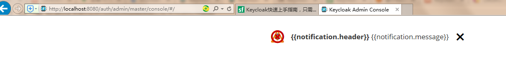

# keycloak install

## keycloak是什么

keycloak是一种面向现代应用和服务的开源IAM（身份识别与访问管理）解决方案

##  keycloak可以做什么

2.1 Keycloak提供了单点登录（SSO）功能

2.2 支持OpenID Connect、OAuth 2.0、SAML 2.0标准协议

2.3 拥有简单易用的管理控制台

2.4 提供对LDAP、Active Directory以及Github、Google等社交账号登录的支持

## keycloak概览

这里先只介绍4个最常用的核心概念：

- Users: 用户，使用并需要登录系统的对象
- Roles: 角色，用来对用户的权限进行管理
- Clients: 客户端，需要接入Keycloak并被Keycloak保护的应用和服务
- Realms: 领域，领域管理着一批用户、证书、角色、组等，一个用户只能属于并且能登陆到一个域，域之间是互相独立隔离的， 一个域只能管理它下面所属的用户

## Keycloak服务安装及配置

### 4.1 安装

安装方式

其中，podman也是一种类docker的容器管理工具，且是centos8默认自带，听说是为了去docker化。

如果想在Linux或windows上安装，选openjdk选项

本次先安装openjdk版，且是standalone模式

#### 4.1.1 下载

First step is to download and extract keycloak-11.0.2.zip（<https://downloads.jboss.org/keycloak/11.0.2/keycloak-11.0.2.zip>） from the Keycloak website.

#### 4.1.2 启动

解压（**尽量不要含中文路径**）、运行：

On Linux run:

`bin/standalone.sh`

On Windows run:

`bin/standalone.bat`

#### 4.1.3 配置管理员

设置管理员的用户名/密码。

地址： <http://localhost:8080/auth> 

#### 4.1.4 登录

用设置的管理员账户登录。

*问题记录：用IE浏览器报错 ：语法错误，可能是IE版本低---------换Chrome浏览器正常*

登录成功后：

#### 4.1.5 创建领域（往下偷懒，我都摘抄英文了。。。）

1. Open the Keycloak Admin Console
2. Hover the mouse over the dropdown in the top-left corner where it says Master, then click on Add realm
3. Fill in the form with the following values:

​    * Name: myrealm

4. Click Create

#### 4.1.6 创建用户

1. Open the Keycloak Admin Console
2. Click Users (left-hand menu)

​    * Click Add user (top-right corner of table)

3. Fill in the form with the following values:

​    * Username: myuser

​    * First Name: Your first name

​    * Last Name: Your last name

4. Click Save

#### 4.1.7 创建客户端

1. Open the Keycloak Admin Console
2. Click 'Clients'
3. Fill in the form with the following values:

​    * Client ID: myclient

​    * Client Protocol: openid-connect

​    * Root URL: （先空着）

4. Click Save

#### 4.1.8 创建角色并关联用户

...

## 保护你的api（postman+springboot+keycloak）

### 5.1 创建springboot工程

### 5.2 配置keycloak

### 5.3 使用postman测试

#### 5.3.1 获取用户token

First, we need to acquire an access token from Keycloak by sending a POST request to this URL:

http://localhost:{port}/auth/realms/{realm_name}/protocol/openid-connect/token

The request should have this JSON body:

{

​    'client_id': 'your_client_id',

​    'username': 'your_username',

​    'password': 'your_password',

​    'grant_type': 'password'

}

#### 5.3.2 访问api

The access token should be used in every request to a Keycloak-protected resource by simply placing it in the Authorization header:

headers: {

​    'Authorization': 'Bearer ' + access_token

}

#### 5.3.3 若token过期

可以通过获取的刷新token来获取新token

Once the access token has expired, we can refresh it by sending a POST request to the same URL as above, but containing the refresh token instead of username and password:

{

   'client_id': 'your_client_id'

   'refresh_token': refresh_token_from_previous_request,

   'grant_type': 'refresh_token'

}

Keycloak will respond to this with a new access_token and refresh_token.